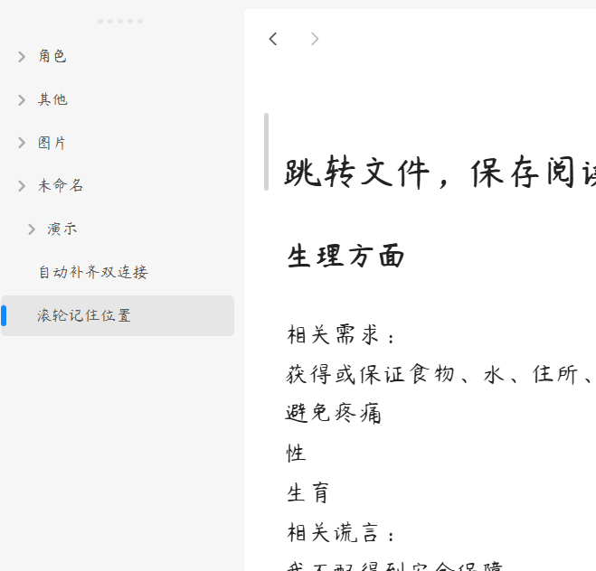

# ✦ 滚轮位置记忆 ✦

我在小红书发布了许多obsidian的教程和插件开发进度，你的关注就是对我最大的支持

滚动到哪里，打开文件就还在哪里。

  

[简体中文](#简体中文) | [用法](#用法)

---

## 简体中文

### Examples 快速示例

**1、无缝滚动恢复**

切换回任何 Markdown 文档时，瞬间恢复至上次停留的滚动位置，实现零闪烁、零跳动。

**2、极简无缝遮罩**

解决 Obsidian 原生切换文件时的画面闪烁问题，带来单页应用般的丝滑体验。

**3、抗位移焦点抑制**

防止编辑器自动夺取焦点导致的二次跳动，页面呈现瞬间即处于绝对静止状态。

**4、智能数据库自动清洗**

自动同步文件重命名/删除，清理孤立数据，保持插件数据轻量整洁。

***

### 核心功能

#### 1. 无感滚动恢复 (Seamless Scroll Recovery)

- **智能记忆**：记录每个文件的精确滚动位置，包括阅读视图和编辑视图。
- **瞬间切换**：返回任何曾经阅读或编辑过的文档时，立即恢复至上次停留的视口高度。

#### 2. 极简无缝遮罩 (Zero-Flash UI Cloaking)

- **痛点解决**：Obsidian 原生切换文件时，常短暂渲染文档顶部再跳转至历史位置，造成刺眼的"白屏/画面闪烁"。
- **技术方案**：检测视图切换时，瞬时将编辑器不透明度设为 `0` 进行无感遮罩。待滚动目标定位稳妥后，再以 `50ms` 极快淡入动效平滑呈现。

#### 3. 抗位移焦点抑制 (Anti-Shift Focus Protection)

- **焦点争夺抑制**：在加载的前 `40毫秒` 黄金保护期内，高频抑制异常焦点。
- **精确定位**：持续应用历史滚动高度，让页面在呈现的瞬间即处于绝对静止状态。

#### 4. 智能数据管理 (Smart Data Management)

- **路径同步**：文件重命名时自动顺延滚动记忆，文件彻底删除时自动销毁对应数据。
- **孤立清洗**：每次启动插件时，自动对比当前库文件，剔除残留的无效滚动数据，防止配置文件冗余。

#### 5. 高性能架构 (Performance-Oriented Architecture)

- **多重防抖机制**：滚动事件和文件操作均采用防抖控制器，合并多余计算，避免高频读写压力。
- **轻量存储**：仅存储文件路径与滚动位置，数据结构简洁高效。

***

## 用法

1. 安装插件后，无需任何配置即可开始工作。
2. 在任何 Markdown 文件中滚动阅读或编辑，插件会自动记录滚动位置。
3. 切换到其他文件后再次返回，滚动位置将自动恢复。
4. 插件完全自动化运行，无需手动干预。

***

### 安装方法

#### 方法一：社区插件安装（推荐）

待插件通过审核并上架社区市场后：
1. 打开 Obsidian **设置** > **社区插件** > **浏览**。
2. 搜索并选择 `Simply Scroll`。
3. 点击 **安装** 并选择 **启用**。

#### 方法二：手动安装

1. 前往 [Releases](https://github.com/hornatx/simply-scroll/releases) 页面下载最新的 `main.js` 和 `manifest.json` 文件。
2. 打开您的 Obsidian 库所在的本地文件夹。
3. 进入 `.obsidian/plugins/` 目录，并创建一个名为 `simply-scroll` 的文件夹。
4. 将下载的两个文件放入该文件夹中。
5. 在 Obsidian **设置** > **社区插件** 中重新加载并开启该插件。

***

### 赞赏支持

🎁 如果觉得有用，请作者喝杯咖啡

 

  

***

QQ 交流群：1094620986